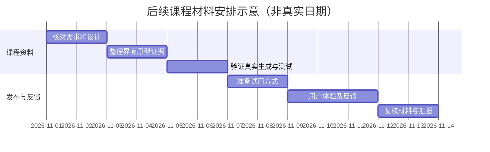

# 个人任务安排示意

以下为基于当前状态的未来工作顺序，非已发生历史；具体日期由本人按实际课程日程填写。37 项任务详见 project_schedule.md，负责人均为本人。

```mermaid
gantt
 title 后续课程材料安排示意（非真实日期）
 dateFormat YYYY-MM-DD
 section 课程资料
 核对需求和设计 :a, 2026-11-01, 2d
 整理界面原型证据 :b, after a, 2d
 验证真实生成与测试 :c, after b, 2d
 section 发布与反馈
 准备试用方式 :d, after c, 2d
 用户体验及反馈 :e, after d, 3d
 复核材料与汇报 :f, after e, 2d
```

这些日期只用于示意图绘制，不作为真实计划或承诺；请用课程实际截止日期替换。
